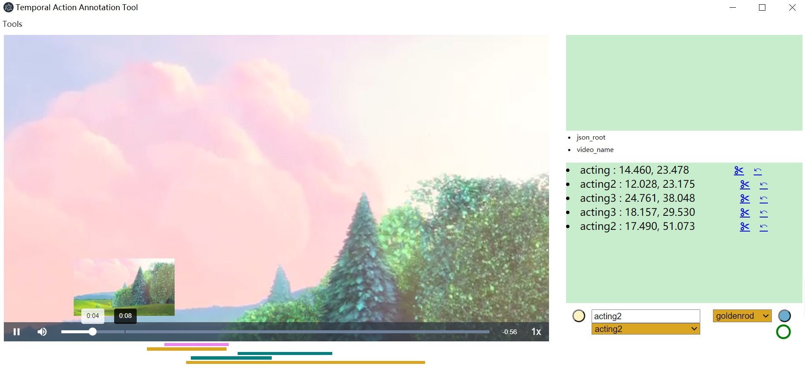

# version 1.0.0

- This project is built by [Electron](https://github.com/electron/electron)

## Usage

```
npm install
npm start
```

## Keyboard Shortcuts

- `q` : set start
- `e` : set end
- `r` : push current annotation into state dict then you can start a new annotation
- `w`: save annotations.json to selected directory
  - every 20s automaticlly save
  - right bottom first button displays save signal
- `space` : pause and start video
- `ctrl+i` : load video directory
- `ctrl+t` : toggleDevTools
- `ctrl+h` : Manual

Please finish current annotation and press '`r`', if you want to modify or remove previous annotation!

# Application Screen

